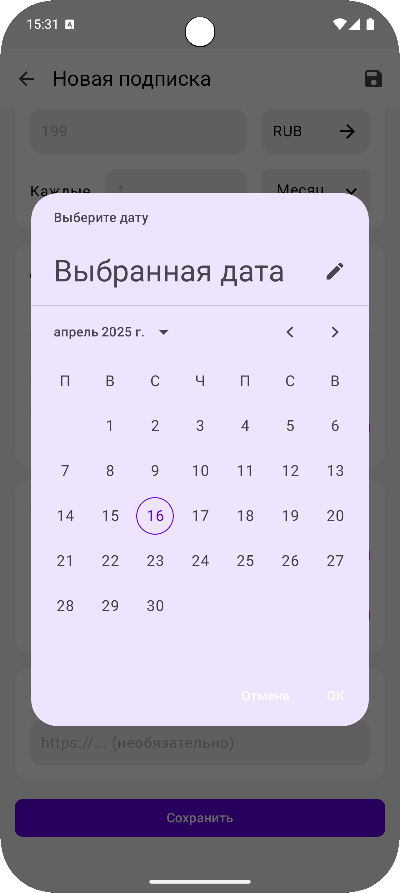
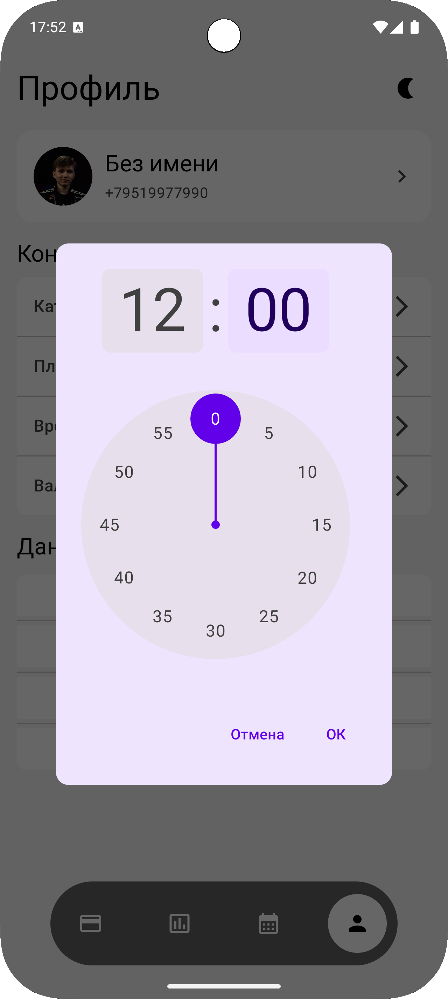
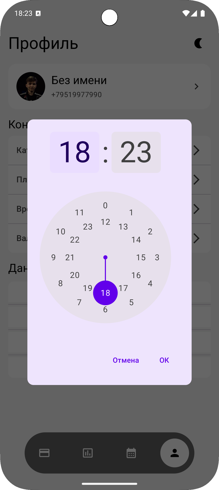

# SubsAndBeer 📱

Android-приложение для управления подписками на услуги с офлайн-режимом и синхронизацией данных.

## О проекте

Дипломная работа — мобильное приложение, которое помогает отслеживать подписки, анализировать расходы и не забывать о списаниях. Разработано как альтернатива существующим решениям с поддержкой офлайн-работы и синхронизации между устройствами.

## Функциональность

- Управление подписками: добавление, редактирование, архивирование, удаление
- Аналитика расходов с круговыми диаграммами по категориям, валютам и методам оплаты
- Календарь предстоящих платежей
- Push-уведомления о списаниях (за 1, 2 или 5 дней)
- Офлайн-режим с синхронизацией при восстановлении соединения
- Авторизация по номеру телефона (звонок с кодом)
- Светлая и тёмная тема

## Стек технологий

**Клиент (Android)**
- Kotlin, Jetpack Compose, MVVM
- Room (локальная БД), Retrofit (HTTP-клиент)
- WorkManager (фоновая синхронизация и уведомления)
- Hilt (DI), EncryptedSharedPreferences (хранение JWT)

**Сервер** (отдельный репозиторий)
- Python, Flask, MySQL
- JWT-аутентификация

## Архитектура

Клиент-серверная система с паттерном MVVM на клиенте. Поддерживает инкрементальную синхронизацию — при изменении данных локально они помечаются как `pending` и отправляются на сервер при наличии соединения.

## Скриншоты

### Авторизация

  
  
  

### Подписки

  
  
  

### Добавление подписки

  
  
  
  
  
  

### Дополнительные элементы интерфейса

  
  
  
  
  

### Аналитика

  
  
  
  
  
  
  
  

### Профиль и настройки

  
  
  
  
  
  
  
  

## Требования

- Android 8.0 (API 26) и выше
- RAM от 2 ГБ
